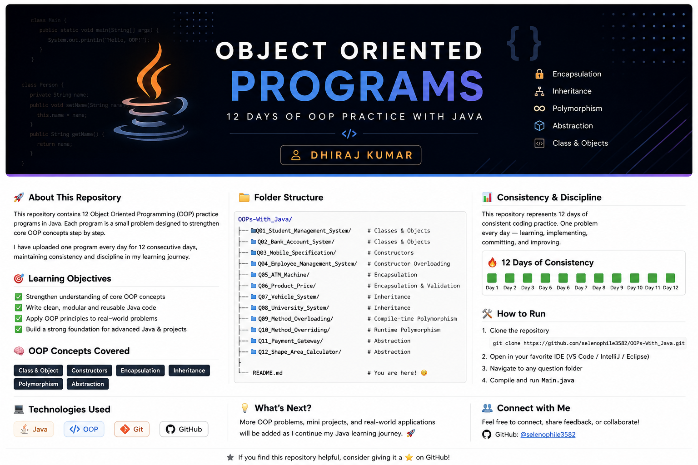

<div align="center">

# Object Oriented Programming with Java



### A structured collection of Java Object-Oriented Programming practice programs.

[](https://www.java.com/)
[](#)
[](https://git-scm.com/)
[](https://github.com/)

</div>

---

# About This Repository

This repository documents my journey of learning **Object-Oriented Programming (OOP)** using **Java**.

Instead of only reading theory, I practiced each core OOP concept by implementing small, focused Java programs. Every folder in this repository represents a different concept, helping me build a strong foundation before moving on to larger Java projects.

One program was uploaded every day for **12 consecutive days**, reflecting consistency, discipline, and continuous learning throughout the process.

---

# Learning Objectives

- Understand core Object-Oriented Programming concepts
- Write clean and modular Java code
- Learn how real-world classes interact with each other
- Practice Java syntax through hands-on implementation
- Build a solid foundation for advanced Java projects

---

# OOP Concepts Covered

| Concept | Status |
|---------|:------:|
| Classes & Objects | ✅ |
| Constructors | ✅ |
| Constructor Overloading | ✅ |
| Encapsulation | ✅ |
| Inheritance | ✅ |
| Polymorphism | ✅ |
| Abstraction | ✅ |

---

# Repository Structure

```text
OOPs-With-Java/
│
├── Q01_Student_Management_System/
│   └── Classes & Objects
│
├── Q02_Bank_Account_System/
│   └── Classes & Objects
│
├── Q03_Mobile_Specification/
│   └── Constructors
│
├── Q04_Employee_Management_System/
│   └── Constructor Overloading
│
├── Q05_ATM_Machine/
│   └── Encapsulation
│
├── Q06_Product_Price/
│   └── Encapsulation & Validation
│
├── Q07_Vehicle_System/
│   └── Inheritance
│
├── Q08_University_System/
│   └── Inheritance
│
├── Q09_Method_Overloading/
│   └── Compile-Time Polymorphism
│
├── Q10_Method_Overriding/
│   └── Runtime Polymorphism
│
├── Q11_Payment_Gateway/
│   └── Abstraction
│
├── Q12_Shape_Area_Calculator/
│   └── Abstraction
│
└── README.md
```

---

# Programs Included

| Question | Program | OOP Concept |
|----------|---------|-------------|
| Q01 | Student Management System | Classes & Objects |
| Q02 | Bank Account System | Classes & Objects |
| Q03 | Mobile Specification | Constructors |
| Q04 | Employee Management System | Constructor Overloading |
| Q05 | ATM Machine | Encapsulation |
| Q06 | Product Price | Encapsulation & Validation |
| Q07 | Vehicle System | Inheritance |
| Q08 | University System | Inheritance |
| Q09 | Method Overloading | Compile-Time Polymorphism |
| Q10 | Method Overriding | Runtime Polymorphism |
| Q11 | Payment Gateway | Abstraction |
| Q12 | Shape Area Calculator | Abstraction |

---

# Consistency & Learning Journey

This repository represents **12 consecutive days of Java practice**.

Instead of rushing through concepts, I focused on understanding each topic individually, implementing it in code, and committing my progress daily.

This repository reflects my learning process, coding discipline, and commitment to improving one concept at a time.

---

# Technologies Used

- Java
- Object-Oriented Programming
- Git
- GitHub

---

# Getting Started

Clone the repository

```bash
git clone https://github.com/selenophile3582/OOPs-With_Java.git
```

Navigate into the project

```bash
cd OOPs-With_Java
```

Open any program folder in your preferred Java IDE (VS Code, IntelliJ IDEA, or Eclipse) and run the corresponding `Main.java` file.

---

# What's Next?

As I continue learning Java, this repository will grow with additional OOP practice problems and improvements.

Future additions may include:

- More Java OOP exercises
- Collections Framework practice
- Exception Handling
- File Handling
- Java Mini Projects

---

# Connect With Me

**Dhiraj Kumar**

GitHub: https://github.com/selenophile3582

---

<div align="center">

### ⭐ If you found this repository helpful, consider giving it a star!

*"Consistency beats intensity. One program every day, one concept at a time."*

</div>